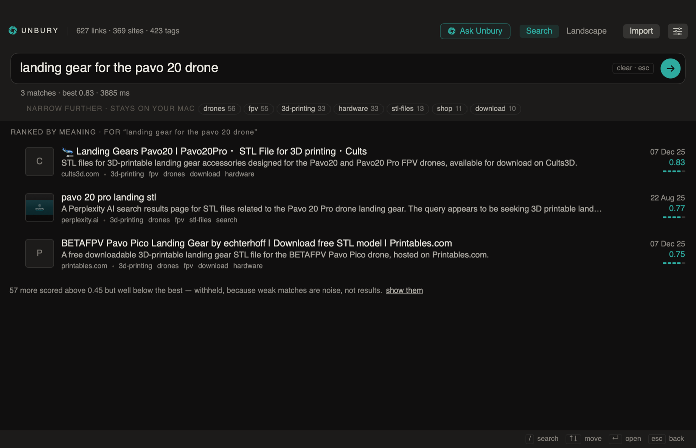

<p align="center">
  
</p>

<h1 align="center">Unbury</h1>

<p align="center">
  <strong>A Mac app that finds a saved link when you have forgotten what it was called.</strong><br><br>
  Ask in plain language. It reads the bookmarks you already have in your browser,
  writes a line about each one, and searches them by meaning rather than by matching words.
</p>

<p align="center">
  <a href="../../releases/latest">
    
  </a>
  
  
  
</p>

> [!IMPORTANT]
> Searching needs an API key you pay for, from [OpenRouter](https://openrouter.ai/keys)
> or [OpenAI](https://platform.openai.com/api-keys). Turning a question into something
> that can be compared against your links is the one part that cannot happen on your Mac.
> It costs thousandths of a cent per question; importing costs about 0.07 cents a link,
> and the app says what it will cost before it spends anything.

## Features

- **Ask in your own words** — "that 3D-printed part for the drone", not the exact title
- **Any language** — ask in Portuguese about a page written in English and it still lands
- **It admits defeat** — when nothing is close enough it says so instead of offering three weak guesses
- **Browse without paying** — the tag cloud, filtering and every list stay on your Mac
- **Your browser is never written to** — Unbury reads the bookmarks file and nothing else
- **Delete a link for good** — deleting here does not delete there, and an import will not bring it back
- **Choose who describes your pages** — Claude Code, Codex, or a model on OpenRouter
- **Ask Unbury** — a conversation that runs its own searches and shows you every one it ran
- **Updates itself** — signed, notarised, and it tells you when there is a new version

## Screenshot

<p align="center">
  
</p>

## Installation

1. Download the DMG from [**Releases**](../../releases/latest).
2. Open it and drag **Unbury** to **Applications**.
3. Open it, and in **Settings** paste your API key.
4. Press **Import from browser** and pick a profile.

The import shows what it will do before it does it — which profiles it found, which
links are new, and roughly what they will cost. Nothing is spent until you press the
button.

## Using it

**Find something.** Type the question and press Return. It does not search as you type:
half a sentence is a different question when the search is by meaning.

**Browse what you have.** The first screen is your tags, sized by how many links each
holds. Choosing several narrows to the links that carry all of them. None of this
leaves your Mac.

**Ask a question about your collection.** Ask Unbury runs the searches itself, rephrases
when the first attempt comes back weak, and shows every search it ran and every link it
read — including the ones it decided not to use.

**From the terminal**, the same engine, for when the app misbehaves and you need to know
whether it is the engine or the interface at fault:

```bash
unburyctl status
unburyctl browsers
unburyctl search "landing gear for the pavo 20"
unburyctl import
unburyctl remove <id or url> --yes
unburyctl restore <url>
```

It ships inside the app, at `/Applications/Unbury.app/Contents/MacOS/unburyctl`.

## Which browsers

Brave, Chrome, Arc, Edge and Vivaldi. Safari and Firefox keep bookmarks in a different
format and are not read yet.

A browser's bookmarks file records no visit history, so Unbury cannot tell you what you
have never opened. That feature does not exist and is not planned.

## Storage

| Data | Location | Leaves your Mac? |
|---|---|:---:|
| Your links and their descriptions | `~/Library/Application Support/Unbury/vault.json` | No |
| The numbers a search is ranked by | `~/Library/Application Support/Unbury/vectors.bin` | No |
| Ask Unbury conversations | `~/Library/Application Support/Unbury/conversations/` | No |
| Settings | `~/Library/Application Support/Unbury/settings.json` | No |
| Your API keys | macOS Keychain, service `com.migsilva.unbury` | No |

Around 3 MB for 600 links. Two things reach the internet and nothing else: the page
being described at import, and the question being turned into numbers when you press
Return. Browsing, filtering and ranking all happen here — comparing a question against
600 links takes about a millisecond.

## Build from source

Requires macOS 14 or later and Swift 6 (Xcode 16).

```bash
git clone https://github.com/migsilva89/unbury.git
cd unbury/app
./build.sh              # assemble and sign Unbury.app
./release.sh 0.1.0      # …plus DMG, Apple notarisation and the update feed
```

Without a Developer ID certificate in your keychain, `build.sh` signs the app ad hoc and
says so — it runs, but macOS will ask for your keychain again after every build.
`release.sh` needs notarisation credentials; [docs/RELEASING.md](docs/RELEASING.md) has
the one-time setup.

## Status

A personal project, made for one person's bookmarks and shared because it might suit
yours. It works and it is used daily; there is no support promise and no roadmap.

Something broken, or an idea: open an [issue](../../issues). Pull requests are read —
[CONTRIBUTING.md](CONTRIBUTING.md) says what is in scope and how to build it — though a
change that argues with a decision in `CLAUDE.md` will be asked to argue with the reasoning
there first. Never put an API key in an issue: the app's own error messages are written to
avoid printing one, but a screenshot of the settings page will.

A security problem goes in a [private advisory](../../security/advisories/new), never a
public issue. See [SECURITY.md](SECURITY.md).

Why it is built the way it is — including the decisions that look like bugs and are not
— is in [CLAUDE.md](CLAUDE.md). Read it before changing anything.

## License

[MIT](LICENSE). The third-party software Unbury links and ships, and its licences,
are listed in [THIRD-PARTY.md](THIRD-PARTY.md).
